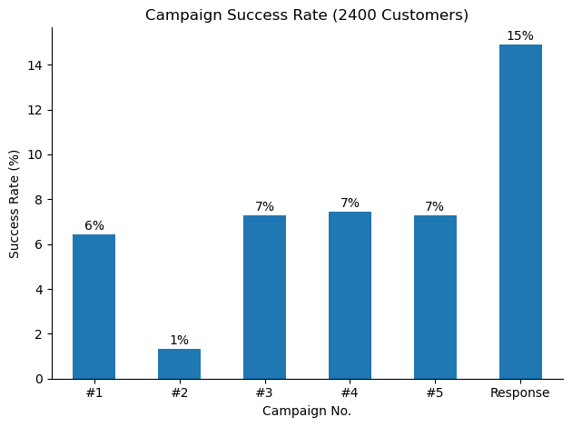
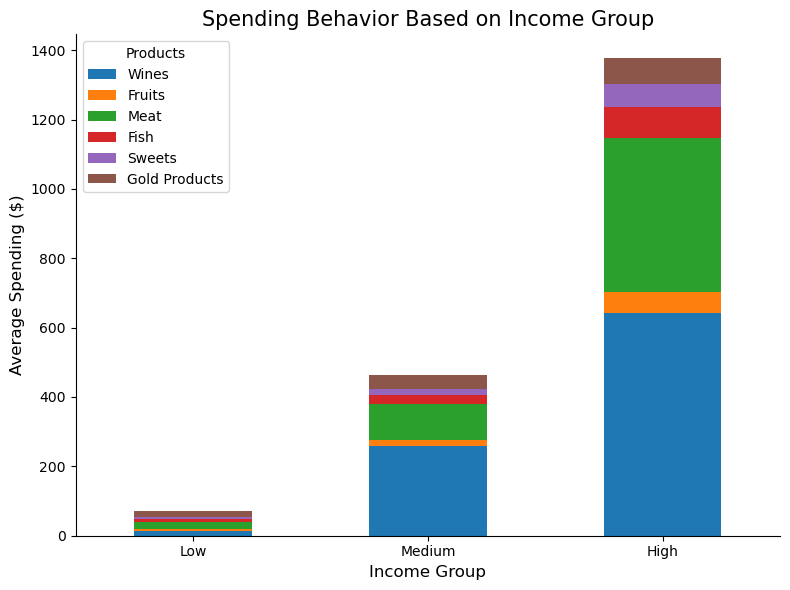
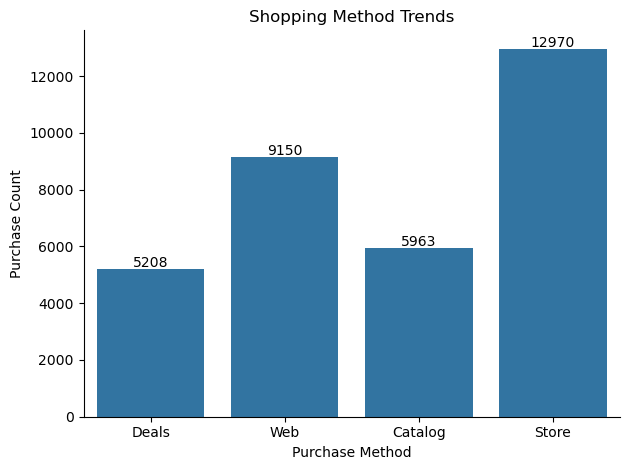

# **Customer Marketing & Purchase Behavior Analysis**  

## **Project Overview**  
This project analyzes customer purchase behavior and marketing campaign effectiveness using a real-world dataset. The goal is to extract key insights and provide data-driven recommendations to optimize marketing strategies.  

**Dataset Source & Credits:** [Marketing Campaign Dataset - Kaggle](https://www.kaggle.com/datasets/rodsaldanha/arketing-campaign)  

## **Objectives**  
- Analyze **customer responses** to different marketing campaigns and identify the most effective ones.  
- Examine **spending behavior** across different income groups to understand purchasing patterns.  
- Compare **online vs. offline purchase trends** to determine preferred shopping methods.  
- Provide **data-driven recommendations** to improve marketing strategies and maximize revenue.  

## **Project Structure**  

### **1. Data Collection & Preprocessing**  
- Import dataset, clean missing values, and format data for analysis.  
- Convert categorical data into numerical form where necessary.  

```python
    import numpy as np
    import pandas as pd
    import matplotlib.pyplot as plt
    import seaborn as sns

    file = pd.read_csv(r'marketing_campaign.csv', sep=';')

    df = pd.DataFrame(file)

    df.drop_duplicates()
    df['income_group'] = pd.cut(df['Income'], bins=[0,30000,70000, float("inf")], labels=['Low', 'Medium', 'High'])
    df['Dt_Customer'] = pd.to_datetime(df['Dt_Customer'])
    df.columns = df.columns.str.lower()
```

### **2. Exploratory Data Analysis (EDA)**  
- Perform summary statistics on customer purchases and responses.  
- Analyze relationships between spending habits, income levels, and campaign success.  

```python
    total_customers = len(df)
    success_rate = df[['acceptedcmp1', 'acceptedcmp2', 'acceptedcmp3', 'acceptedcmp4', 'acceptedcmp5', 'response']].sum().reset_index()
    success_rate.columns = ['campaign', 'percent']
    success_rate['percent'] = (success_rate['percent']/total_customers) * 100

    new_labels_campaign = ['#1', '#2', '#3', '#4', '#5', 'Response',]
    ax0 = success_rate.plot(kind='bar')
    sns.despine()
    for i, v in enumerate(success_rate['percent']):
        ax0.text(i, v + 0.2, f"{int(round(v))}%", ha='center')
    ax0.set_xticks(range(len(new_labels_campaign)))
    ax0.set_xticklabels(labels=new_labels_campaign, rotation=0 )
    ax0.get_legend().remove()
    plt.title('Campaign Success Rate (2400 Customers)')
    plt.xlabel('Campaign No.')
    plt.ylabel('Success Rate (%)')
    plt.tight_layout()
    plt.show()
```

```python
    income_group_spend = df.groupby('income_group', observed=True)[['mntwines','mntfruits','mntmeatproducts','mntfishproducts','mntsweetproducts','mntgoldprods']].mean().reset_index()

    ax1 = income_group_spend.set_index('income_group').plot(kind='bar', stacked=True, figsize=(8, 6))
    new_labels_prod = ["Wines", "Fruits", "Meat", "Fish", "Sweets", "Gold Products"]
    ax1.legend(labels=new_labels_prod, title='Products', fontsize=10)
    sns.despine()
    plt.title('Spending Behavior Based on Income Group', fontsize=15)
    plt.xlabel('Income Group', fontsize=12)
    plt.xticks(rotation=0)
    plt.ylabel('Average Spending ($)', fontsize=12)
    plt.tight_layout()
    plt.show()
```

```python
    purchases = df[['numdealspurchases', 'numwebpurchases', 'numcatalogpurchases', 'numstorepurchases']].sum()

    new_labels_purchase = ['Deals', 'Web', 'Catalog', 'Store']

    ax2 = sns.barplot(data=purchases)
    for i, v in enumerate(purchases):
        ax2.text(i, v + 65, str(v), ha='center')
    ax2.set_xticks(range(len(new_labels_purchase)))
    ax2.set_xticklabels(labels=new_labels_purchase )
    sns.despine()
    plt.xlabel("Purchase Method")
    plt.ylabel("Purchase Count")
    plt.title("Shopping Method Trends")
    plt.tight_layout()
    plt.show()
```

### **3. Data Visualization & Insights**  
- Visualize purchasing trends using bar charts, histograms, and scatter plots.  
- Identify the most successful marketing channels and products based on spending behavior.







## **Findings**  

- **In-store shopping leads with 12,970 purchases, followed by online with 9,150.** These two channels should be prioritized for revenue growth.  
- **The "Response" campaign had the highest success rate at 15%.** Future marketing efforts should replicate its approach.  
- **High-income customers are the biggest spenders, particularly on wines and meat.** Targeted premium product promotions can increase high-margin sales.    

## **Conclusion**  
This project showcases how data analysis can reveal purchasing behavior trends, campaign performance, and optimization opportunities for marketing strategies using Python.  

## **Author**  
[Engr. Kurt Avery Santos](https://github.com/KurtAvery25)  

